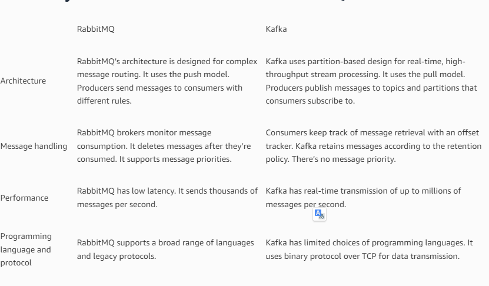

# APACHE KAPKA
### Core Concepts.
- `Apache Kafka` is distributed system, it act as a cluster
- A `Kafka cluster` consists of a set of brokers with minimum of 3 brokers
- A `Broker` is the Kafka server It acts as broker or an agent to exchange messages bw Producer and Consumer.
- `Producer` send the message to Kafka only.
- `Consumer` ask for the message from Kafka
- `Topic` is place where the messages are stored and topic is identified by a name
- Can have any number of topic in a broker.
- `Kafka Partitions` Topics are devided into a number of partitions which contain records in an unchangeable 
  sequence, if data volume large we can share into multiple parts and distributed among multiple Kafka broker and 
  Kafka cluster.

`What different bw RabbitMQ and Kafka`
https://aws.amazon.com/compare/the-difference-between-rabbitmq-and-kafka/
