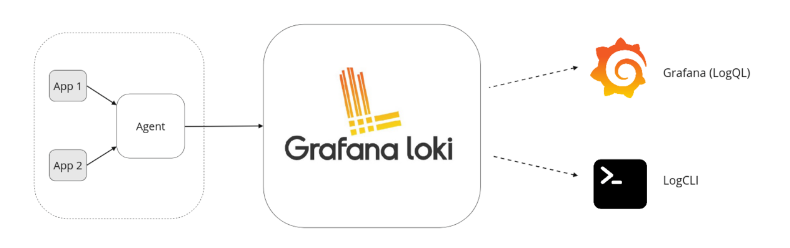

# Grafana

## Grafana Loki
It is a set of component that can be composed into fully featured logging stack. Unlike logging systems, Loki only indexing metadata about your logs (just like Prometheus labels) as a set of labels for each log stream, it doesn't index the contents of the logs. Log data itself is then compressed and stored in chunks in object store such S3, ... event locally on file system.

#### 1. Loki overview
Loki is a horizontally-scalable, highly-available, multi-tenant log aggregation system inspired by Prometheus. 
Loki focus on logs instead of metrics as Prometheus, collecting logs via push instead of pull

- Agent - that is our project or client which distributed with Loki. The agent scrapes logs, turn the logs into streams by adding labels then pushes the streams to Loki through an HTTP API.
- Loki - The loki server which ingesting and storing logs in processing queries.
- Grafana - for querying and displaying log data. You also can query logs from LogCLI cmd or using Loki API directly.

`Loki features`
- `scalability`